# POC: AI-Powered Development Team Automation

## Epic Principale

**EPIC: Sistema Multi-Agente per Automazione Software Development Lifecycle**

*Come sviluppatore/team lead, voglio un sistema di agenti AI che possa gestire l'intero ciclo di sviluppo software dalla richiesta del cliente al deploy, così da automatizzare task ripetitivi e accelerare la delivery.*

---

## 1. Diagramma di Flusso Generale

```mermaid
flowchart TD
    Start([Cliente: Richiesta Progetto]) --> PM[PM Agent: Analisi Requisiti]
    PM --> HasQuestions{Info<br/>Mancanti?}
    
    HasQuestions -->|Sì| Stakeholder[Human-in-the-Loop:<br/>Domande Stakeholder]
    Stakeholder --> PM
    
    HasQuestions -->|No| Requirements[Documento Requisiti]
    Requirements --> TechLead[TechLead Agent:<br/>Design Architettura]
    
    TechLead --> ArchDoc[Documento Architettura]
    ArchDoc --> TaskBreakdown[TechLead: Task Breakdown]
    
    TaskBreakdown --> Tasks[Lista Task Prioritizzate]
    Tasks --> SeniorReview{Senior Review}
    
    SeniorReview -->|Modifiche| TechLead
    SeniorReview -->|Approvato| DevTeam[Dev Team Agents]
    
    DevTeam --> CodeGen[Generazione Codice]
    CodeGen --> JuniorCode[Junior: Features Base]
    CodeGen --> SeniorCode[Senior: Integrazioni Complesse]
    
    JuniorCode --> CodeReview{Code Review<br/>Automatico}
    SeniorCode --> CodeReview
    
    CodeReview -->|Issues| DevTeam
    CodeReview -->|OK| Testing[Testing Agent]
    
    Testing --> TestResults{Tests Pass?}
    TestResults -->|Fail| DevTeam
    TestResults -->|Pass| Deploy[Deploy Agent]
    
    Deploy --> CI[Genera CI/CD Config]
    CI --> Infra[Genera Infrastructure Code]
    Infra --> DeployReady([Deploy Ready])
    
    style Start fill:#e1f5e1
    style DeployReady fill:#e1f5e1
    style PM fill:#fff4e1
    style TechLead fill:#fff4e1
    style DevTeam fill:#e1ecf5
    style Deploy fill:#f5e1f5
    style Stakeholder fill:#ffe1e1
```



---

## 2. Architettura Sistema


---

## 3. Epic Breakdown in User Stories

### **Sprint 1: Foundation (Week 1-2)**

#### **US-1.1: Setup Base Infrastructure**
```yaml
Story: Come sviluppatore, voglio il setup base del progetto così da poter iniziare lo sviluppo

Tasks:
  - Setup progetto Python con Poetry/pip
  - Installare Ollama e scaricare modelli base
  - Creare struttura cartelle
  - Setup LangGraph base
  - Creare ProjectState base

Acceptance Criteria:
  ✓ Progetto inizializzato con dipendenze
  ✓ Ollama funzionante con llama3.1:8b
  ✓ LangGraph importabile e configurato
  ✓ Test smoke pass

Effort: 3 SP
```

#### **US-1.2: PM Agent - Analisi Base**
```yaml
Story: Come PM, voglio un agente che analizzi richieste cliente e generi requisiti base

Tasks:
  - Creare PM agent con prompt engineering
  - Implementare parsing requisiti
  - Generare documento markdown requirements
  - Identificare informazioni mancanti
  
Acceptance Criteria:
  ✓ Agent riceve input testuale
  ✓ Genera lista requisiti funzionali
  ✓ Identifica almeno 3 info mancanti
  ✓ Output in markdown leggibile

Effort: 5 SP
```

#### **US-1.3: State Management & Persistence**
```yaml
Story: Come sistema, voglio persistere lo stato del workflow per continuare sessioni

Tasks:
  - Implementare TypedDict per ProjectState
  - Setup SQLite checkpointer
  - Salvare/caricare stato workflow
  - Implementare thread_id management

Acceptance Criteria:
  ✓ Stato salvato dopo ogni step
  ✓ Recupero stato da DB
  ✓ Multiple sessioni simultanee
  ✓ History navigabile

Effort: 5 SP
```

---

### **Sprint 2: Core Agents (Week 3-4)**

#### **US-2.1: TechLead Agent - Architecture Design**
```yaml
Story: Come TechLead, voglio un agente che progetti architettura tecnica da requisiti

Tasks:
  - Creare TechLead agent con prompt specifico
  - Analizzare requisiti e suggerire stack
  - Generare diagramma architettura (Mermaid)
  - Creare task breakdown

Acceptance Criteria:
  ✓ Input: requirements doc
  ✓ Output: architecture.md con diagrammi
  ✓ Tech stack raccomandato
  ✓ Lista task con stime

Effort: 8 SP
```

#### **US-2.2: Human-in-the-Loop Integration**
```yaml
Story: Come stakeholder, voglio poter rispondere a domande durante il workflow

Tasks:
  - Implementare interrupt points in LangGraph
  - CLI interactive per input utente
  - Validation risposte
  - Resume workflow dopo input

Acceptance Criteria:
  ✓ Workflow si ferma per domande
  ✓ CLI mostra domande chiare
  ✓ Input salvato nello state
  ✓ Workflow continua correttamente

Effort: 5 SP
```

#### **US-2.3: Document Generator Tool**
```yaml
Story: Come sistema, voglio generare documenti professionali in vari formati

Tasks:
  - Template Jinja2 per documenti
  - Generatore markdown
  - Export PDF con WeasyPrint
  - Export DOCX con python-docx

Acceptance Criteria:
  ✓ Template customizzabili
  ✓ Output markdown formattato
  ✓ PDF con styling professionale
  ✓ DOCX editabile

Effort: 5 SP
```

---

### **Sprint 3: Development Agents (Week 5-6)**

#### **US-3.1: Junior Dev Agent - Code Generation**
```yaml
Story: Come junior dev, voglio un agente che generi codice base da task

Tasks:
  - Setup qwen2.5-coder:7b per coding
  - Prompt engineering per qualità codice
  - Generazione file strutturati
  - Commenti e documentazione

Acceptance Criteria:
  ✓ Input: task description
  ✓ Output: codice funzionante
  ✓ File structure corretta
  ✓ Codice commentato

Effort: 8 SP
```

#### **US-3.2: Senior Dev Agent - Complex Features**
```yaml
Story: Come senior dev, voglio un agente per features complesse e integrazioni

Tasks:
  - Agent con context awareness
  - Pattern recognition (design patterns)
  - Integrazione API esterne
  - Error handling avanzato

Acceptance Criteria:
  ✓ Codice con design patterns
  ✓ Gestione errori completa
  ✓ Integrazioni testate
  ✓ Best practices applicate

Effort: 13 SP
```

#### **US-3.3: Code Review Agent**
```yaml
Story: Come reviewer, voglio un agente che faccia code review automatico

Tasks:
  - Analisi statica con tree-sitter
  - Check best practices
  - Security scan base
  - Suggestions improvements

Acceptance Criteria:
  ✓ Identifica code smells
  ✓ Security issues rilevati
  ✓ Suggerimenti concreti
  ✓ Report formattato

Effort: 8 SP
```

---

### **Sprint 4: Testing & Deploy (Week 7-8)**

#### **US-4.1: Testing Agent**
```yaml
Story: Come QA, voglio un agente che generi e esegua test automatici

Tasks:
  - Generazione unit tests
  - Generazione integration tests
  - Test runner integration
  - Coverage report

Acceptance Criteria:
  ✓ Test generati per ogni funzione
  ✓ Test eseguiti automaticamente
  ✓ Coverage > 70%
  ✓ Report dettagliato

Effort: 8 SP
```

#### **US-4.2: Deploy Agent - CI/CD Generation**
```yaml
Story: Come DevOps, voglio un agente che generi configurazioni deploy

Tasks:
  - Template GitHub Actions / GitLab CI
  - Docker compose generation
  - Kubernetes manifests base
  - Environment variables management

Acceptance Criteria:
  ✓ CI/CD pipeline funzionante
  ✓ Docker build automatico
  ✓ Deploy configurato
  ✓ Secrets gestiti

Effort: 8 SP
```

---

## 4. Diagramma Sequence - Workflow Completo


---

## 5. Struttura Progetto POC

```
ai-dev-team/
├── pyproject.toml              # Dependencies
├── README.md
├── .env.example
│
├── config/
│   ├── agents.yaml            # Agent configurations
│   ├── prompts/               # Prompt templates
│   │   ├── pm.txt
│   │   ├── tech_lead.txt
│   │   ├── senior_dev.txt
│   │   └── junior_dev.txt
│   └── models.yaml            # Ollama model mappings
│
├── src/
│   ├── __init__.py
│   │
│   ├── models/                # Data models
│   │   ├── __init__.py
│   │   ├── state.py          # ProjectState TypedDict
│   │   ├── requirements.py
│   │   ├── architecture.py
│   │   └── task.py
│   │
│   ├── agents/                # Agent implementations
│   │   ├── __init__.py
│   │   ├── base.py           # Base Agent class
│   │   ├── pm_agent.py
│   │   ├── tech_lead_agent.py
│   │   ├── senior_dev_agent.py
│   │   ├── junior_dev_agent.py
│   │   ├── reviewer_agent.py
│   │   └── deploy_agent.py
│   │
│   ├── workflows/             # LangGraph workflows
│   │   ├── __init__.py
│   │   ├── main_workflow.py
│   │   └── subworkflows/
│   │       ├── requirements_flow.py
│   │       └── development_flow.py
│   │
│   ├── tools/                 # Utility tools
│   │   ├── __init__.py
│   │   ├── document_generator.py
│   │   ├── code_analyzer.py
│   │   ├── test_runner.py
│   │   └── git_handler.py
│   │
│   ├── llm/                   # LLM integrations
│   │   ├── __init__.py
│   │   ├── ollama_client.py
│   │   └── prompt_builder.py
│   │
│   └── cli/                   # CLI interface
│       ├── __init__.py
│       └── main.py
│
├── tests/
│   ├── test_agents/
│   ├── test_workflows/
│   └── test_tools/
│
├── outputs/                   # Generated projects
│   └── .gitkeep
│
└── examples/
    ├── simple_crud_app.yaml
    └── healthcare_integration.yaml
```

---

## 6. Implementazione Blocchi Core

### **Blocco 1: ProjectState**

```python
# src/models/state.py
from typing import TypedDict, List, Optional, Dict, Annotated
from datetime import datetime
import operator

class UserStory(TypedDict):
    id: str
    title: str
    description: str
    acceptance_criteria: List[str]
    priority: str  # high, medium, low

class TechStack(TypedDict):
    backend: List[str]
    frontend: List[str]
    database: str
    infrastructure: List[str]
    
class Task(TypedDict):
    id: str
    title: str
    description: str
    assigned_to: str  # junior, senior
    estimated_hours: int
    dependencies: List[str]
    status: str  # pending, in_progress, review, done

class ProjectState(TypedDict):
    # Meta
    session_id: str
    created_at: str
    current_phase: str  # init, pm, tech_design, dev, deploy, complete
    iterations: Annotated[int, operator.add]  # Incrementa automaticamente
    
    # Input Cliente
    client_request: str
    client_context: Optional[Dict]
    
    # PM Phase
    requirements: List[str]
    user_stories: List[UserStory]
    missing_info: List[str]
    stakeholder_answers: Optional[Dict]
    requirements_doc: Optional[str]  # Path to file
    
    # TechLead Phase
    tech_stack: Optional[TechStack]
    architecture_description: Optional[str]
    architecture_diagram: Optional[str]  # Mermaid code
    tasks: List[Task]
    architecture_doc: Optional[str]  # Path to file
    
    # Dev Phase
    generated_code: Dict[str, str]  # filepath: content
    code_review_feedback: List[Dict]
    tests_generated: bool
    tests_passed: bool
    
    # Deploy Phase
    ci_cd_config: Optional[str]
    docker_config: Optional[str]
    deploy_ready: bool
    
    # Errors & Logging
    errors: Annotated[List[str], operator.add]
    logs: Annotated[List[Dict], operator.add]
```

### **Blocco 2: Base Agent**

```python
# src/agents/base.py
from abc import ABC, abstractmethod
from typing import Dict, Any
from langchain_ollama import ChatOllama
from src.models.state import ProjectState
import yaml
import os

class BaseAgent(ABC):
    def __init__(self, name: str, model: str = "llama3.1:8b"):
        self.name = name
        self.model = model
        self.llm = ChatOllama(
            model=model,
            temperature=0.7,
            num_ctx=8192  # Context window
        )
        self.prompt_template = self._load_prompt()
    
    def _load_prompt(self) -> str:
        """Carica prompt template da file"""
        prompt_path = f"config/prompts/{self.name}.txt"
        if os.path.exists(prompt_path):
            with open(prompt_path, 'r') as f:
                return f.read()
        return self._default_prompt()
    
    @abstractmethod
    def _default_prompt(self) -> str:
        """Default prompt se file non esiste"""
        pass
    
    def invoke(self, state: ProjectState) -> ProjectState:
        """Main execution method"""
        try:
            # Log start
            self._log(state, f"{self.name} started")
            
            # Execute agent logic
            result = self.execute(state)
            
            # Log completion
            self._log(result, f"{self.name} completed")
            
            return result
        except Exception as e:
            return self._handle_error(state, e)
    
    @abstractmethod
    def execute(self, state: ProjectState) -> ProjectState:
        """Agent-specific logic - da implementare nelle sottoclassi"""
        pass
    
    def _log(self, state: ProjectState, message: str):
        """Aggiunge log allo state"""
        log_entry = {
            "timestamp": datetime.now().isoformat(),
            "agent": self.name,
            "message": message,
            "phase": state.get("current_phase", "unknown")
        }
        state.setdefault("logs", []).append(log_entry)
    
    def _handle_error(self, state: ProjectState, error: Exception) -> ProjectState:
        """Gestisce errori durante esecuzione"""
        error_msg = f"{self.name} error: {str(error)}"
        state.setdefault("errors", []).append(error_msg)
        self._log(state, error_msg)
        return state
```

### **Blocco 3: PM Agent Implementation**

```python
# src/agents/pm_agent.py
from src.agents.base import BaseAgent
from src.models.state import ProjectState, UserStory
from typing import List, Dict
import re
import json

class PMAgent(BaseAgent):
    def __init__(self):
        super().__init__(name="pm", model="llama3.1:8b")
    
    def _default_prompt(self) -> str:
        return """Sei un Product Manager esperto con 10+ anni di esperienza.

Il tuo compito è analizzare la richiesta del cliente e produrre:

1. **Requisiti Funzionali**: Lista chiara e dettagliata
2. **User Stories**: In formato "Come [ruolo], voglio [azione] così da [beneficio]"
3. **Domande Mancanti**: Informazioni critiche da chiedere allo stakeholder

**Output Format richiesto (JSON):**
```json
{
  "requirements": ["req1", "req2", ...],
  "user_stories": [
    {
      "id": "US-1",
      "title": "...",
      "description": "Come [ruolo], voglio...",
      "acceptance_criteria": ["criteri1", "criterio2"],
      "priority": "high|medium|low"
    }
  ],
  "missing_info": ["domanda1", "domanda2", ...]
}
```

**Principi**:
- Essere specifici e actionable
- Identificare REALMENTE info mancanti (non domande generiche)
- Prioritizzare user stories per valore business

**Richiesta Cliente**:
{client_request}

**Contesto Aggiuntivo**:
{context}
"""
    
    def execute(self, state: ProjectState) -> ProjectState:
        # Prepara input per LLM
        prompt = self.prompt_template.format(
            client_request=state["client_request"],
            context=json.dumps(state.get("client_context", {}), indent=2)
        )
        
        # Invoca LLM
        response = self.llm.invoke(prompt)
        content = response.content
        
        # Parse JSON response (con fallback)
        try:
            parsed = self._extract_json(content)
        except json.JSONDecodeError:
            # Fallback: parsing manuale
            parsed = self._manual_parse(content)
        
        # Genera documento markdown
        doc_path = self._generate_document(parsed, state)
        
        # Aggiorna state
        return {
            **state,
            "requirements": parsed["requirements"],
            "user_stories": parsed["user_stories"],
            "missing_info": parsed["missing_info"],
            "requirements_doc": doc_path,
            "current_phase": "pm_complete",
            "iterations": state.get("iterations", 0) + 1
        }
    
    def _extract_json(self, content: str) -> Dict:
        """Estrae JSON da response LLM"""
        # Cerca blocco ```json
        json_match = re.search(r'```json\s*(\{.*?\})\s*```', content, re.DOTALL)
        if json_match:
            return json.loads(json_match.group(1))
        
        # Cerca JSON diretto
        json_match = re.search(r'\{.*\}', content, re.DOTALL)
        if json_match:
            return json.loads(json_match.group(0))
        
        raise json.JSONDecodeError("No JSON found", content, 0)
    
    def _manual_parse(self, content: str) -> Dict:
        """Parsing manuale se JSON fallisce"""
        # Implementazione semplificata
        return {
            "requirements": self._extract_list(content, "Requirements|Requisiti"),
            "user_stories": [],
            "missing_info": self._extract_list(content, "Missing Info|Domande|Questions")
        }
    
    def _extract_list(self, content: str, pattern: str) -> List[str]:
        """Estrae liste da testo"""
        # Cerca sezione e estrae bullet points
        section_match = re.search(
            rf'(?:{pattern}).*?(?:\n[-*]\s+(.+))+',
            content,
            re.IGNORECASE | re.DOTALL
        )
        if section_match:
            items = re.findall(r'[-*]\s+(.+)', section_match.group(0))
            return [item.strip() for item in items]
        return []
    
    def _generate_document(self, data: Dict, state: ProjectState) -> str:
        """Genera documento markdown professionale"""
        from datetime import datetime
        import os
        
        # Crea cartella output
        output_dir = f"outputs/{state['session_id']}"
        os.makedirs(output_dir, exist_ok=True)
        
        doc_path = f"{output_dir}/01_requirements.md"
        
        with open(doc_path, 'w', encoding='utf-8') as f:
            f.write(f"# Requirements Document\n\n")
            f.write(f"**Project**: {state['client_request'][:100]}...\n\n")
            f.write(f"**Date**: {datetime.now().strftime('%Y-%m-%d')}\n\n")
            f.write(f"**PM Agent**: v1.0\n\n")
            f.write("---\n\n")
            
            f.write("## Functional Requirements\n\n")
            for i, req in enumerate(data["requirements"], 1):
                f.write(f"{i}. {req}\n")
            
            f.write("\n## User Stories\n\n")
            for story in data["user_stories"]:
                f.write(f"### {story['id']}: {story['title']}\n\n")
                f.write(f"**Priority**: {story['priority']}\n\n")
                f.write(f"{story['description']}\n\n")
                f.write("**Acceptance Criteria**:\n")
                for criterion in story['acceptance_criteria']:
                    f.write(f"- {criterion}\n")
                f.write("\n")
            
            if data["missing_info"]:
                f.write("\n## Missing Information\n\n")
                f.write("⚠️ **The following information is needed from stakeholders:**\n\n")
                for i, question in enumerate(data["missing_info"], 1):
                    f.write(f"{i}. {question}\n")
        
        return doc_path
```

### **Blocco 4: Workflow Orchestrator**

```python
# src/workflows/main_workflow.py
from langgraph.graph import StateGraph, END
from langgraph.checkpoint.sqlite import SqliteSaver
from src.models.state import ProjectState
from src.agents.pm_agent import PMAgent
# ... altri agents

import sqlite3

def create_workflow():
    """Crea il workflow principale"""
    
    # Inizializza checkpointer per persistenza
    conn = sqlite3.connect("workflow_state.db", check_same_thread=False)
    checkpointer = SqliteSaver(conn)
    
    # Crea graph
    workflow = StateGraph(ProjectState)
    
    # Inizializza agenti
    pm_agent = PMAgent()
    # tech_lead_agent = TechLeadAgent()
    # ... altri
    
    # === NODI ===
    
    def pm_analysis(state: ProjectState) -> ProjectState:
        """Nodo PM: Analisi requisiti"""
        return pm_agent.invoke(state)
    
    def check_missing_info(state: ProjectState) -> str:
        """Conditional edge: controlla se servono info"""
        if state.get("missing_info") and len(state["missing_info"]) > 0:
            return "ask_stakeholder"
        return "tech_design"
    
    def stakeholder_input(state: ProjectState) -> ProjectState:
        """Nodo Human-in-the-loop"""
        # Questo causa un interrupt - workflow si ferma qui
        # Verrà resumato quando l'utente fornisce input
        return state
    
    # Aggiungi nodi
    workflow.add_node("pm_analysis", pm_analysis)
    workflow.add_node("stakeholder_input", stakeholder_input)
    # workflow.add_node("tech_design", tech_lead_agent.invoke)
    # ... altri nodi
    
    # === EDGES ===
    
    # Entry point
    workflow.set_entry_point("pm_analysis")
    
    # PM -> conditional
    workflow.add_conditional_edges(
        "pm_analysis",
        check_missing_info,
        {
            "ask_stakeholder": "stakeholder_input",
            "tech_design": "tech_design"  # Prossimo nodo
        }
    )
    
    # Stakeholder -> PM (re-analysis con nuove info)
    workflow.add_edge("stakeholder_input", "pm_analysis")
    
    # ... altre edges
    
    # Compila graph
    app = workflow.compile(
        checkpointer=checkpointer,
        interrupt_before=["stakeholder_input"]  # Stop qui per input umano
    )
    
    return app
```

### **Blocco 5: CLI Interface**

```python
# src/cli/main.py
import typer
from rich.console import Console
from rich.prompt import Prompt, Confirm
from rich.markdown import Markdown
from rich.panel import Panel
from rich.progress import Progress, SpinnerColumn, TextColumn
from src.workflows.main_workflow import create_workflow
from src.models.state import ProjectState
import uuid
from datetime import datetime

app = typer.Typer()
console = Console()

@app.command()
def create(
    request: str = typer.Option(..., "--request", "-r", help="Cliente request"),
    interactive: bool = typer.Option(True, "--interactive/--no-interactive", "-i/-I")
):
    """Crea un nuovo progetto con AI agents"""
    
    console.print(Panel.fit(
        "[bold blue]🤖 AI Development Team[/bold blue]\n"
        "Multi-agent system for automated software development",
        border_style="blue"
    ))
    
    # Crea workflow
    workflow = create_workflow()
    
    # Stato iniziale
    initial_state: ProjectState = {
        "session_id": str(uuid.uuid4()),
        "created_at": datetime.now().isoformat(),
        "current_phase": "init",
        "iterations": 0,
        "client_request": request,
        "client_context": None,
        "requirements": [],
        "user_stories": [],
        "missing_info": [],
        "stakeholder_answers": None,
        "requirements_doc": None,
        "tech_stack": None,
        "architecture_description": None,
        "architecture_diagram": None,
        "tasks": [],
        "architecture_doc": None,
        "generated_code": {},
        "code_review_feedback": [],
        "tests_generated": False,
        "tests_passed": False,
        "ci_cd_config": None,
        "docker_config": None,
        "deploy_ready": False,
        "errors": [],
        "logs": []
    }
    
    config = {
        "configurable": {
            "thread_id": initial_state["session_id"]
        }
    }
    
    console.print(f"\n[yellow]📝 Client Request:[/yellow] {request}\n")
    
    with Progress(
        SpinnerColumn(),
        TextColumn("[progress.description]{task.description}"),
        console=console
    ) as progress:
        
        # Esegui workflow step by step
        for event in workflow.stream(initial_state, config):
            for node_name, node_state in event.items():
                if node_name == "pm_analysis":
                    task = progress.add_task("🔍 PM Agent analyzing requirements...", total=None)
                    progress.update(task, completed=True)
                    
                    # Mostra risultati
                    console.print("\n[green]✓ PM Analysis Complete[/green]\n")
                    
                    if node_state.get("requirements_doc"):
                        console.print(f"📄 Document generated: {node_state['requirements_doc']}")
                    
                    console.print(f"\n[bold]Requirements found:[/bold] {len(node_state['requirements'])}")
                    console.print(f"[bold]User stories:[/bold] {len(node_state['user_stories'])}")
                    
                    # Check missing info
                    if node_state.get("missing_info"):
                        console.print(f"\n[yellow]⚠️  Missing information: {len(node_state['missing_info'])} questions[/yellow]")
                
                elif node_name == "stakeholder_input":
                    # Human-in-the-loop
                    console.print("\n" + "="*60)
                    console.print("[bold red]🛑 Stakeholder Input Required[/bold red]")
                    console.print("="*60 + "\n")
                    
                    missing = node_state.get("missing_info", [])
                    answers = {}
                    
                    for i, question in enumerate(missing, 1):
                        console.print(f"\n[cyan]Question {i}/{len(missing)}:[/cyan]")
                        console.print(f"  {question}")
                        answer = Prompt.ask("  [green]Your answer[/green]")
                        answers[question] = answer
                    
                    # Resume workflow con risposte
                    node_state["stakeholder_answers"] = answers
                    node_state["missing_info"] = []  # Clear questions
                    
                    # Continue workflow
                    workflow.update_state(config, node_state)
    
    # Workflow completato
    console.print("\n" + "="*60)
    console.print("[bold green]✅ Project Creation Complete![/bold green]")
    console.print("="*60)
    
    # Output summary
    final_state = workflow.get_state(config)
    console.print(f"\n📊 [bold]Summary:[/bold]")
    console.print(f"  Session ID: {final_state.values['session_id']}")
    console.print(f"  Phase: {final_state.values['current_phase']}")
    console.print(f"  Iterations: {final_state.values['iterations']}")
    console.print(f"  Errors: {len(final_state.values.get('errors', []))}")
    
    if final_state.values.get("requirements_doc"):
        console.print(f"\n📁 [bold]Generated Files:[/bold]")
        console.print(f"  • {final_state.values['requirements_doc']}")


@app.command()
def resume(session_id: str):
    """Resume un workflow esistente"""
    workflow = create_workflow()
    config = {"configurable": {"thread_id": session_id}}
    
    # Get current state
    state = workflow.get_state(config)
    
    console.print(f"\n[yellow]Resuming session {session_id}[/yellow]")
    console.print(f"Current phase: {state.values['current_phase']}")
    
    # Continue...
    # (implementazione simile a create)


@app.command()
def list_sessions():
    """Lista tutti i workflow salvati"""
    # Query dal DB SQLite
    import sqlite3
    conn = sqlite3.connect("workflow_state.db")
    cursor = conn.cursor()
    
    cursor.execute("""
        SELECT DISTINCT thread_id, thread_ts 
        FROM checkpoints 
        ORDER BY thread_ts DESC 
        LIMIT 10
    """)
    
    sessions = cursor.fetchall()
    
    console.print("\n[bold]Recent Sessions:[/bold]\n")
    for session_id, timestamp in sessions:
        console.print(f"  • {session_id} - {timestamp}")


if __name__ == "__main__":
    app()
```

---

## 7. Test dei Blocchi Core

```python
# tests/test_pm_agent.py
import pytest
from src.agents.pm_agent import PMAgent
from src.models.state import ProjectState

def test_pm_agent_basic():
    """Test PM agent con richiesta semplice"""
    agent = PMAgent()
    
    state: ProjectState = {
        "session_id": "test-123",
        "created_at": "2025-01-01",
        "current_phase": "init",
        "iterations": 0,
        "client_request": "Voglio un'app per gestire appuntamenti medici",
        "client_context": None,
        # ... altri campi required
    }
    
    result = agent.invoke(state)
    
    # Assertions
    assert len(result["requirements"]) > 0
    assert result["current_phase"] == "pm_complete"
    assert result["requirements_doc"] is not None
    assert len(result["user_stories"]) > 0

def test_pm_agent_missing_info():
    """Test che PM identifichi info mancanti"""
    agent = PMAgent()
    
    state: ProjectState = {
        # ...
        "client_request": "Voglio un'app",  # Molto vago
        # ...
    }
    
    result = agent.invoke(state)
    
    # Deve identificare info mancanti
    assert len(result["missing_info"]) > 0
```

---

## 8. Piano di Sviluppo Step-by-Step

### **Week 1: Setup & PM Agent**
```bash
# Day 1-2: Setup
mkdir ai-dev-team && cd ai-dev-team
poetry init
poetry add langgraph langchain-ollama typer rich pydantic pyyaml
ollama pull llama3.1:8b

# Day 3-4: ProjectState & Base Agent
# Implementa state.py e base.py

# Day 5-7: PM Agent completo
# Implementa pm_agent.py
# Test manuale con CLI minimo
python -m src.cli.main create -r "App todo list"
```

### **Week 2: Workflow & Persistence**
```bash
# Day 8-10: Workflow orchestrator
# Implementa main_workflow.py
# Test con interrupt e resume

# Day 11-12: Human-in-the-loop
# Implementa interactive CLI
# Test con stakeholder questions

# Day 13-14: Document generation
# Templates professionali
# Export multi-formato
```

### **Week 3-4: TechLead & Dev Agents**
```bash
# Implementazione graduale altri agenti
# Test incrementale ogni agente
# Integration testing
```

---

## 9. Metriche di Successo POC

```yaml
Successo POC:
  ✓ PM Agent funzionante end-to-end
  ✓ Requirements doc generato correttamente
  ✓ Human-in-the-loop funzionante
  ✓ State persistence con resume
  ✓ Almeno 1 workflow completo: richiesta -> requirements doc
  
Bonus:
  ✓ TechLead agent con architecture doc
  ✓ Code generation base funzionante
  ✓ 70% coverage test
```

---

## 10. Quick Start Commands

```bash
# Clone & Setup
git clone <repo>
cd ai-dev-team
poetry install

# Start Ollama
ollama serve
ollama pull llama3.1:8b

# Primo progetto
poetry run python -m src.cli.main create \
  --request "App gestione biblioteca con prestiti e catalogazione"

# Resume dopo interrupt
poetry run python -m src.cli.main resume <session-id>

# Lista progetti
poetry run python -m src.cli.main list-sessions
```

---

Vuoi che sviluppi uno specifico blocco per iniziare subito? Posso creare:
1. **Setup completo con codice funzionante** (copy-paste ready)
2. **Solo PM Agent** isolato per testing immediato
3. **Workflow minimo** PM → TechLead
4. **CLI completo** con tutte le feature

Quale preferisci per partire? 🚀
